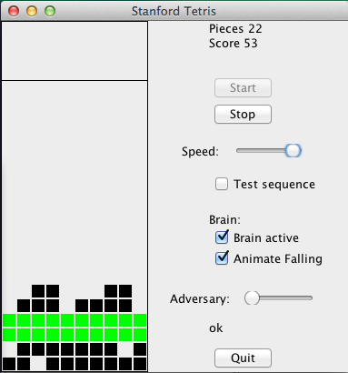

@author: ccwilliams
@date:   2014-01

This is a Java implementation of tetris for Stanford's OOP course. It emphasizes
test-driven development (JUnit), OOP encapsulation and modularity. Generally, the 
code is divided into a **Piece**, **Board**, **Tetris (GUI)**, **Brain**, and
**test** classes. 

####Piece.java
Manages the `TPoint`s which make up a Piece, Piece size, and 
rotation. It utilizes the **singleton pattern** for speed so that Pieces in
different rotation states need only be initialized once.

####Board.java
Stores the current state of the game as a 2D grid of booleans.
It handles operations such computing where Pieces may be placed, row clearing,
detecting filled rows, board integrity, etc. It does not do any drawing or managing of pixels
(this is done by `JTetris`). 
It also implements a *1-step undo* functionality, which is used by the Tetris 
Brain to test moves in order to find the best move at a given time. 

####JTetris.java (provided to us)
Provides GUI a user-only (no computer) version of the game in which
speed can be toggled and Pieces moved with j/k/l keys. The "test sequence"
option toggles a specific set of 100 pieces to be used, for testing.

####JBrainTetris 
Extends JTetris to include a simple AI brain to auto-play pieces. 
It employs a simple heuristic to compute the best play available by iterating
over possible rotations and drop-points for a given piece given the current
board state. It also includes an "adversary" option which toggles on a mode 
that provides the WORST possible piece (computed with the logic in the 
Brain class) given the current state of the board.

Code that was provided/I did not write included: `TPoint.java`, `DefaultBrain.java`, 
`Brain.java`, and `JTetris.java`
